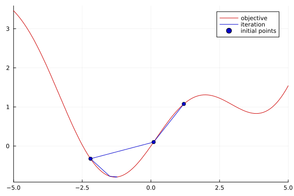

# QuadraticOptimizer.jl

A Julia implementation for quadratic interpolation method (QIM) and quadratic fitting method (QFM).

[](https://hyrodium.github.io/QuadraticOptimizer.jl/stable)
[](https://hyrodium.github.io/QuadraticOptimizer.jl/dev)
[](https://github.com/hyrodium/QuadraticOptimizer.jl/actions)
[](https://codecov.io/gh/hyrodium/QuadraticOptimizer.jl)
[](https://github.com/JuliaTesting/Aqua.jl)
[](https://pkgs.genieframework.com?packages=QuadraticOptimizer)

Quadratic interpolation method is an optimization method by interpolating given evaluation points with a quadratic polynomial.

## 1-dim example
```julia
julia> using QuadraticOptimizer

julia> f(x) = sin(x) + x^2/10  # Function to minimize
f (generic function with 1 method)

julia> xs_init = [1.2, 0.1, -2.2]  # Initial points (3 points are required to construct parabola)
3-element Vector{Float64}:
  1.2
  0.1
 -2.2

julia> xs, fs = optimize_qim(f, xs_init, 10)  # Optimize 10 steps
([1.2, 0.1, -2.2, -1.4980661244174434, -1.2293686986818357, -1.3061365335230135, -1.3059492270208548, -1.3064424808417185, -1.3064400170208186, -1.306440099017006, -1.3066465256797584, -1.306452471584103, -1.3064400463690848], [1.0760390859672262, 0.10083341664682816, -0.32449640381959, -0.7729361131769432, -0.7911428696877567, -0.79458228390424, -0.7945821972306206, -0.7945823375579667, -0.7945823375615284, -0.7945823375615235, -0.7945823127123063, -0.7945823374710272, -0.7945823375615275])

julia> using Plots

julia> pl = plot(f; xlims=(-5,5), color=:red3, label="objective")

julia> plot!(pl, xs, fs; color=:blue3, label="iteration")

julia> scatter!(pl, xs_init, f.(xs_init); color=:blue3, label="initial points")
```



## 2-dim example

```julia
using QuadraticOptimizer
using StaticArrays
import Random
using Plots

f(p) = p[1]^2 + sin(p[1]) + 1.5p[2]^2 + sinh(p[2]) - p[1]*p[2]/5
Random.seed!(42)
xs_init = rand(6)
ys_init = rand(6)
ps_init = SVector.(xs_init, ys_init)
ps, fs = optimize_qim(f, ps_init, 20)
xs_plot = -3:0.1:3
ys_plot = -5:0.1:3
zs_plot = f.(tuple.(xs_plot', ys_plot))
plot(xs_plot, ys_plot, zs_plot; levels=-40:40, label="objective")
plot!([p[1] for p in ps], [p[2] for p in ps]; color=:blue2, label="iteration")
scatter!([p[1] for p in ps_init], [p[2] for p in ps_init], label="initial points")
```


```julia
using QuadraticOptimizer
using StaticArrays
import Random
using Plots

f(p) = p[1]^2 + sin(p[1]) + 1.5p[2]^2 + sinh(p[2]) - p[1]*p[2]/5
Random.seed!(42)
ps_init = [@SVector rand(2) for _ in 1:10]
ps = copy(ps_init)
ps, fs = optimize_qfm(f, ps, 20)
xs_plot = -3:0.1:3
ys_plot = -5:0.1:3
zs_plot = f.(tuple.(xs_plot', ys_plot))
plot(xs_plot, ys_plot, zs_plot; levels=-40:40, label="objective")
plot!([p[1] for p in ps], [p[2] for p in ps]; color=:blue2, label="iteration")
scatter!([p[1] for p in ps_init], [p[2] for p in ps_init], label="initial points")
```


